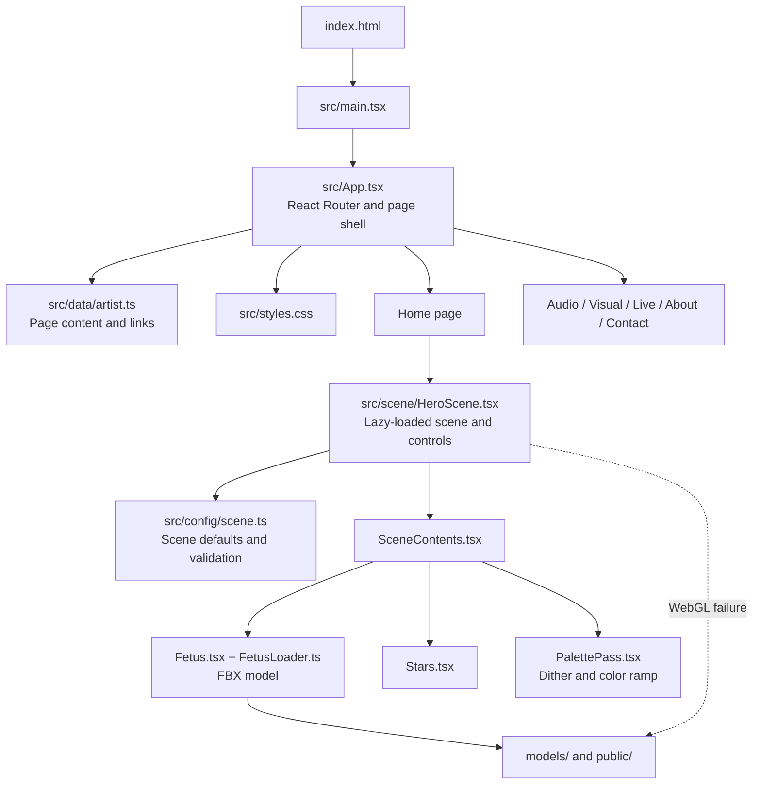

# 25ohms / OHMEGA

An artist portfolio built around an interactive, palette-mapped wireframe sculpture. The site combines editable portfolio content with a browser-rendered 3D hero scene. Fonts and runtime images are served locally; no credentials or environment variables are required.

## Installation and setup

Use Node.js 24 LTS, as recorded in `.nvmrc`, and npm. With [nvm](https://github.com/nvm-sh/nvm) installed:

```sh
nvm install
nvm use
npm ci
npm run dev
```

Open the local URL printed by Vite. `npm run build` type-checks and creates the production site in `dist/`; `npm run preview` serves that build locally. `npm ci` uses the committed `package-lock.json` for a reproducible dependency install.

## Main stack and why it is used

- **Vite** provides the local development server and produces static files that can be hosted without an application server.
- **React and TypeScript** structure the site into reusable page and scene components while catching many content and configuration mistakes during the build.
- **React Router** handles the portfolio's direct routes (`/audio`, `/visual`, `/live`, `/about`, and `/contact`) as a single-page site.
- **Three.js with React Three Fiber** renders the interactive OHMEGA sculpture and star field. React Three Fiber lets the scene live alongside the React interface; Three.js supplies the WebGL rendering primitives.
- **A custom Three.js palette pass** creates the dithered, limited-color treatment. DOM text and controls remain regular HTML for accessibility and responsive layout.
- **Plain CSS** styles the site without adding a component framework, keeping the visual system and responsive rules close to the project.
- **Vitest and Playwright** support scene-level and browser-level checks; **ESLint and Prettier** support consistent source code.

## Architecture

The browser starts at `index.html`, mounts the React application, and uses the router to render a page. The home page lazy-loads the 3D scene so other routes do not need to load its scene code or model. The scene renders to an offscreen target before the palette pass displays it.



## Repository layout

```text
.
├── index.html                 # HTML entry point
├── src/
│   ├── main.tsx               # React bootstrap, router, local fonts and CSS
│   ├── App.tsx                # Shared shell, navigation and route pages
│   ├── data/artist.ts         # Page copy, navigation and public social links
│   ├── config/scene.ts        # Scene defaults and configuration validation
│   ├── scene/                 # 3D scene, model loader, palette effect and tests
│   └── styles.css             # Site layout, typography and responsive styles
├── public/                    # Favicon and runtime fallback still images
├── models/fetus/source/       # Source FBX loaded by the 3D scene
├── reference/                 # Artist source notes and TouchDesigner reference
├── scripts/                   # Cleanup, capture and production-check utilities
├── tests/                      # Playwright browser tests
├── package.json               # Dependencies and project commands
├── package-lock.json          # Reproducible npm dependency tree
└── *config files              # Vite, TypeScript, lint, format and test settings
```

`dist/` is generated output, not source. It is only needed for deployment or `npm run preview`, and can be recreated with `npm run build`. Browser test output and optional screenshots go under the ignored `.artifacts/` directory. Run `npm run clean` to remove generated output after testing or previewing.

`node_modules/` is a local install and is ignored by Git. Commit `package-lock.json` so other developers and CI can use `npm ci`. The fallback images in `public/` and the FBX in `models/` are runtime assets and should be versioned with the source.

## Tune the sculpture

In development, click **Tune scene +** on the landing page. The panel controls:

- Model rotation (degrees in the panel, radians in the configuration), position, scale, wire intensity, and opacity.
- Camera field of view, framing padding, and idle rotation speed.
- Bayer matrix size (2, 4, or 8), pixel size in CSS pixels, strength, and quantization levels.
- Lookup colors and intermediate stop positions; endpoints stay at 0 and 1.
- Star count, size, brightness, random seed, pixel density, and render resolution.

**Capture pose** pauses rotation and synchronizes the controls with the actual dragged pose. **Export JSON** includes that live pose and all other settings. Import accepts 2–8 ordered palette stops, including endpoints at 0 and 1. **Reset all** restores the committed defaults. Draft settings persist in this browser under `25ohms.scene.v1`; production neither reads nor writes them.

To promote a preset, replace the `DEFAULT_SCENE` object in `src/config/scene.ts` with the exported JSON object. Keep its `SceneConfig` annotation. Rebuild, inspect the result, then regenerate the fallback image. This is deliberately a manual, reviewable change: the tuning panel never rewrites source files.

Visitors can drag to inspect, use the arrow keys when the scene is focused, press Space to pause/resume, and press Home to reset. On touchscreens, horizontal swipes rotate while vertical gestures can scroll the page. Reduced motion starts the sculpture still.

## Rendering and model compatibility

`Fetus` loads the original `models/fetus/source/scene.fbx`, centers its bounds, and applies one shared, unlit white wire material. `Stars` creates a deterministic point field. `PalettePass` renders both to an offscreen target, quantizes luminance using a Bayer threshold, and samples a color-ramp texture. Palette colors are stored in sRGB, decoded for sampling, and converted to the display color space once at the output. Text and controls stay in the DOM.

The supplied MODO FBX contains two artifacts that stock FBXLoader cannot parse: an empty normals layer and an unconnected `MODO_RenderSettings` model. `FetusLoader` ignores those two node names in a copied buffer. The source file and all geometry data remain intact. A test parses the real asset and checks finite geometry and unchanged source bytes.

The scene caps device pixel ratio and reduces offscreen resolution if measured frame rate stays below 42 FPS after warmup. Animation stops while the scene is outside the viewport or the document is hidden. Paused scenes render on demand. Model data is cached for route revisits, while per-mount materials and postprocessing resources are disposed. The renderer uses WebGL2; failure shows `public/ohmega-still.png` and keeps the website usable.

## Content and next milestone

- `src/data/artist.ts`: navigation, section descriptions, biography, and named public social links.
- `src/styles.css`: palette, typography, spacing, and responsive layouts.
- `src/App.tsx`: home and section templates for Audio, Visual, Live, About, and Contact.

Audio, Visual, and Live have intentional empty states and real external links. About uses the supplied bio. Contact currently links to Instagram; it has no form or submission backend. The supplied SoundCloud insights URL is a private dashboard and is not published.

The next milestone adds hosted audio files and a persistent HTML audio player mounted in the application shell, outside route content; real project and performance entries; and a contact form with a delivery service. No fake music, shows, or project records are included. There is no CMS, analytics, or server API in this milestone.

## Checks and previews

```sh
npm run lint
npm test
npm run build
npx playwright install chromium firefox webkit
npm run test:e2e
```

Browser tests cover actual model loading, motion controls, route transitions, reduced motion, live-pose export/persistence, failure fallback, mobile layout, and direct section URLs. Desktop/mobile emulation does not replace physical-device testing.

With the development server running, refresh the fallback from the actual scene:

```sh
npm run capture
```

The script uses fresh browser storage and reduced motion, so it captures committed defaults. It writes desktop/mobile fallback images under `public/ohmega-still*.png`. Rebuild after changing the fallback.

Screenshots are optional: `node scripts/preview.mjs --previews` writes desktop, mobile, and development-panel previews to `.artifacts/previews/`. They are not required to run or deploy the website.

Run `npm run check:production` with `npm run preview -- --port 4173` running to check that production omits tuning code, ignores development storage, lazy-loads 3D assets, and handles a lost WebGL context. `npm run format` formats the editable source.

## Hosting

Deploy the contents of `dist/` to a static host. Configure SPA fallback so requests such as `/audio` serve `index.html` with status 200; missing assets should still return 404. For example, on Netlify add `/* /index.html 200` as a rewrite, or on Nginx use `try_files $uri $uri/ /index.html`. Keep the app at the domain root unless Vite's base and the router basename are changed together.

The 3D scene is lazy-loaded on the landing page. Development controls are removed from production. No deployment has been made by this repository setup.
